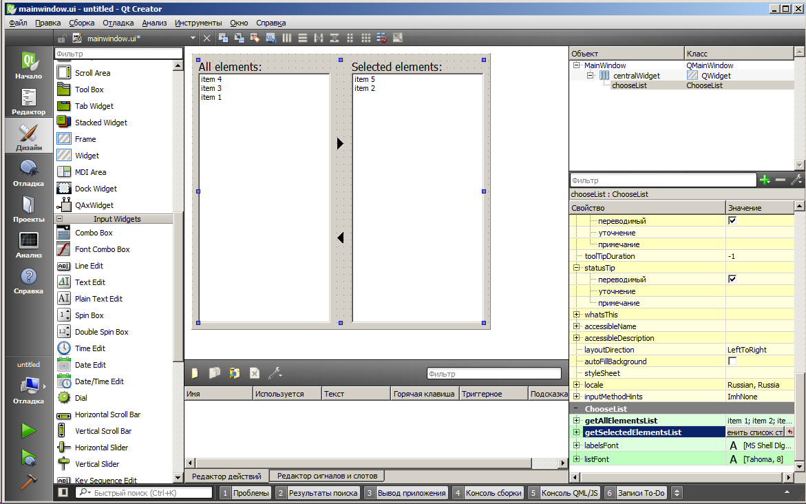

# Custom widgets

Custom widget - библиотека-плагин для QtDesigner, которая содержит в себе несколько кастомных виджетов.

richLabel - label, размер шрифта которого меняется в зависимости от размера виджета
ChooseList - виджет который представляет из себя две колонки с списками и возможность перебрасывания элементов между ними
MyTableView - TableView для которого можно в качестве фона установить изображение
ExtendedTableView - TableView с возможностью установки фильтров отображения для каждой колонки, предусмотрена возможность интерактивного скрытия/показа выбранных колонок, сохраняние/загрузка пресетов отображения

