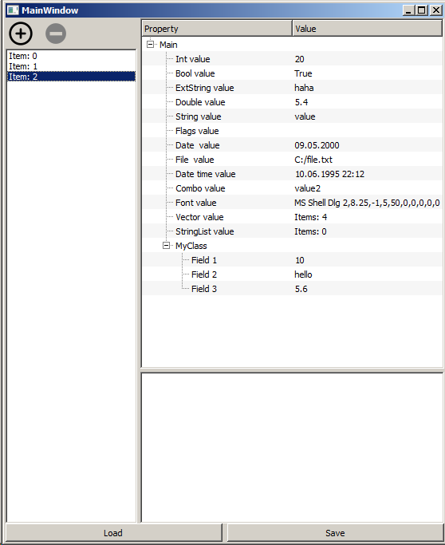
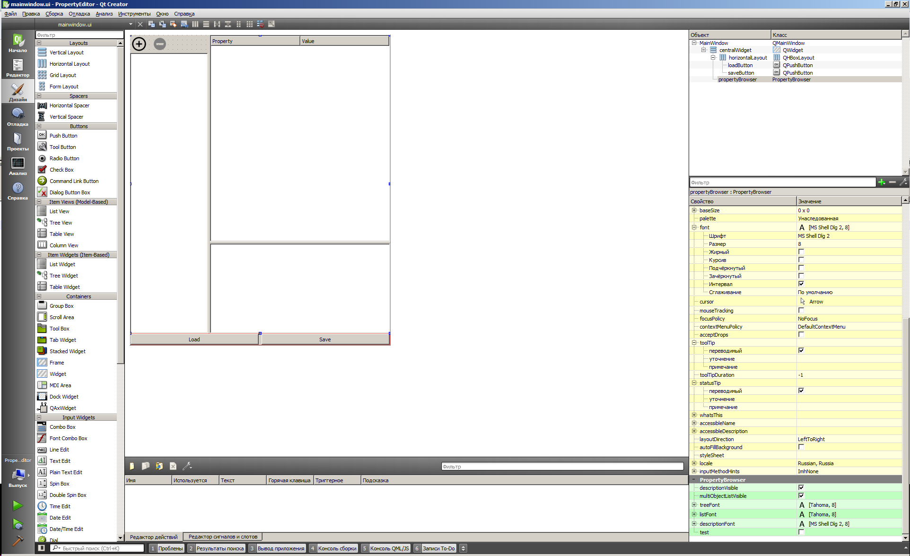

# PropertyBrowser

Библиотека-плагин для QtCreator. 
Содержит в себе один визуальный компонент PropertyBrowser. 
PropertyBrowser предоставляет удобный интерфейс для редактирования свойств объектов, которые поддерживает  такие типы как: 
-int 
-double 
-QString 
-QFont 
-QDate 
-QDateTime 
-bool 
-QStringList 
 
так же есть дополнительные типы: 
-ComboType - редактор с выпадающим списком 
-FileType - для указания файла или директории с диалогом 
-FlagsType - выпадающий список с возможностью выбора нескольких вариантов 
-ExtString - редактор для текстов побольше 
-QVector<QVariant> - отображения дополнительного PropertyBrowser для редактирования списка QVariant 
 
есть возможность разворачивания вложенных классов. 
разбиение свойств по группам. 
управления отображением, режимом только чтение. 
возможность создания своего редактора для своих типов. 
 
Групповое редактирование нескольких объектов. 
 
Библиотека организована в виде плагина для QDesigner. Что дает возможность использовать виджет в визуальном редакторе. 
 
В папке с проектом примером есть собранная программа. 
Для работы библиотеки и программы необходимы Qt 5.4 MSVC 2010 

