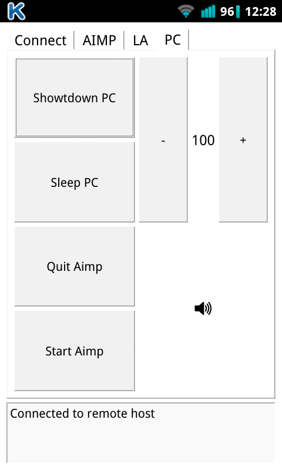
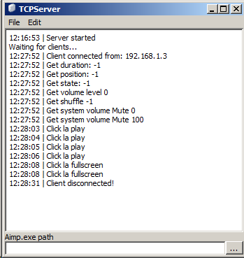

Клиент-серверное приложение для удаленного управления некоторым функционалом компьютера.

Управление аудиопроигрывателем AIMP
Управление видеопроигрывателем LightAllow

TCPServerGui предназначен для ОС Windows, так как использует WinApi

TCPClient собирается под любую платформу.

Обмен данными организован по протоколу TCP

Писал для себя, для управления компьютером с телефона/планшета android

